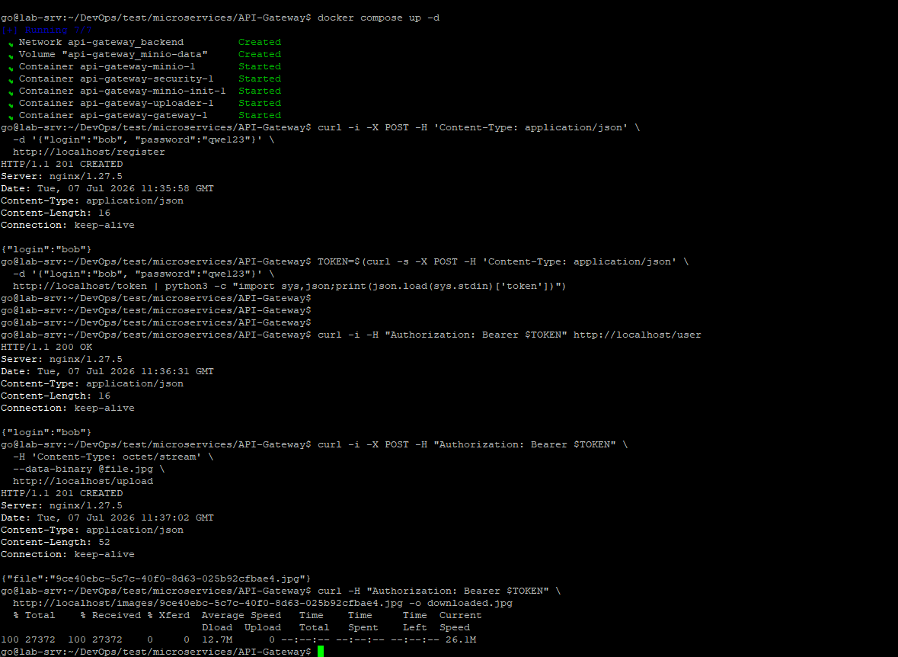

# Домашнее задание: Микросервисы — принципы

## Задача 1: API Gateway

### Требования
- маршрутизация запросов к нужному сервису на основе конфигурации;
- проверка аутентификационной информации в запросах;
- терминация HTTPS.

### Сравнительная таблица

| Критерий | NGINX (OSS) | HAProxy | Kong Gateway | Traefik | Apache APISIX | AWS API Gateway |
|---|---|---|---|---|---|---|
| Маршрутизация по конфигурации | Да (location/upstream, конфиг-файл) | Да (ACL + backend/frontend в конфиг-файле) | Да (декларативно, БД или YAML) | Да (авто-обнаружение из Docker/K8s + статический конфиг) | Да (etcd/декларативный конфиг) | Да (через консоль/IaC) |
| Проверка аутентификации | Через `auth_request` / njs-модули / сторонние модули | Ограниченно: базовая через ACL/HTTP-заголовки; сложная логика (JWT, вызов внешнего сервиса) требует Lua (только в enterprise-сборке) или внешнего слоя | Встроенные плагины (JWT, key-auth, OAuth2, LDAP) | Через middleware (basic-auth, forward-auth) | Встроенные плагины (JWT, key-auth, OAuth2, OpenID) | Встроенная интеграция с IAM/Cognito/Lambda authorizer |
| Терминация HTTPS | Да, из коробки | Да, из коробки | Да | Да, включая авто-получение сертификатов (Let's Encrypt) | Да | Да, управляется AWS |
| Динамическая конфигурация без перезапуска | Ограниченно (reload) | Да (Runtime API для серверов, но не для новых frontend/маршрутов) | Да (Admin API) | Да (авто-discovery) | Да (Admin API, etcd) | Да |
| Плагины/расширяемость | Через модули/Lua (OpenResty) | Ограниченная (Lua только в HAProxy Enterprise) | Богатая экосистема плагинов | Средняя (middleware) | Богатая экосистема плагинов | Ограничено сервисами AWS |
| Простота эксплуатации | Высокая, знаком большинству DevOps | Высокая для L4/L7-балансировки, но неудобна для сложной L7-логики (auth, трансформация запросов) | Средняя (нужна БД или decK) | Высокая, особенно в контейнерных средах | Средняя (etcd как зависимость) | Высокая, но vendor lock-in |
| Стоимость | Бесплатно (OSS) | Бесплатно (OSS) / Enterprise платно | Бесплатно (OSS) / Enterprise платно | Бесплатно (OSS) / Enterprise платно | Бесплатно (Apache 2.0) | Платно по трафику |
| Привязка к облаку | Нет | Нет | Нет | Нет | Нет | Да (только AWS) |

### Выбор и обоснование

Выбор — **NGINX (в связке с модулем `auth_request` и, при необходимости, `njs`)**, дополнительно можно рассматривать **Kong Gateway**(построенный поверх того же NGINX/OpenResty), если потребуется богатая экосистема готовых плагинов аутентификации/лимитирования без написания собственной логики.

Обоснование выбора NGINX:
- маршрутизация на основе `location`/`upstream` полностью закрывает требование конфигурационной маршрутизации;
- модуль `auth_request` позволяет делегировать проверку токена внешнему сервису аутентификации без встраивания бизнес-логики в шлюз;
- терминация HTTPS через `ssl_certificate`/`ssl_certificate_key` реализуется "из коробки", включая современные протоколы TLS 1.2/1.3;
- решение бесплатное, не создаёт vendor lock-in и легко переносится между облаком и on-premise.

---

## Задача 2: Брокер сообщений

### Требования
- поддержка кластеризации для надёжности;
- хранение сообщений на диске в процессе доставки;
- высокая скорость работы;
- поддержка различных форматов сообщений;
- разделение прав доступа к разным потокам сообщений;
- простота эксплуатации.

### Сравнительная таблица

| Критерий | Apache Kafka | RabbitMQ | Apache Pulsar | NATS JetStream |
|---|---|---|---|---|
| Кластеризация | Да, встроенная (репликация партиций) | Да (кластер + зеркалирование очередей) | Да, встроенная (раздельные слои brokers/bookies) | Да (кластеризация с raft) |
| Персистентность на диске | Да, журнал сегментов на диске | Да (durable очереди) | Да (Apache BookKeeper) | Да (файловое хранилище) |
| Скорость/пропускная способность | Очень высокая, оптимизирован под большие потоки | Высокая, но ниже Kafka на больших объёмах | Высокая, сравнима с Kafka | Высокая, обычно выше по задержкам, ниже по объёму данных |
| Поддержка форматов сообщений | Любой формат (byte-массив), интеграция со Schema Registry (Avro/JSON/Protobuf) | Любой формат (byte-массив), нет встроенной валидации схем | Любой формат + встроенная схема-регистрация | Любой формат (byte-массив) |
| Разделение прав доступа (ACL) | Да, ACL на уровне топика | Да, права на уровне vhost/очереди/exchange | Да, ACL на уровне namespace/topic | Да, ACL на уровне субъектов/потоков (начиная с NATS 2.x) |
| Простота эксплуатации | Средняя/низкая (нужен ZooKeeper или KRaft, требует тюнинга) | Высокая (проще в развёртывании и поддержке) | Средняя/низкая (два слоя компонентов: brokers + bookies) | Высокая (единый бинарник, минимум зависимостей) |
| Экосистема/зрелость | Очень зрелая, стандарт де-факто в микросервисах | Зрелая, широко используется | Зрелая, но менее распространена | Растущая, менее зрелая экосистема |

### Выбор и обоснование

1. Для большинства корпоративных информационных систем, при умеренных объёмах сообщений где не требуется экстремальная пропускная способность, оптимальным выбором является **RabbitMQ**.

    - Обоснование:

      - поддерживает кластеры;
      - обеспечивает надежную доставку сообщений;
      - хранит сообщения на диске;
      - имеет развитую систему разграничения прав;
      - прост в эксплуатации;
      - обладает удобным Web-интерфейсом администрирования.

2. Для крупной компании, где система должна обрабатывать миллионы сообщений в секунду и хранить их историю длительное время, предпочтительнее использовать **Apache Kafka**.

    - Обоснование:

      - кластеризация и репликация партиций обеспечивают отказоустойчивость и распределение нагрузки между брокерами;
      - сообщения физически пишутся на диск (журнал), что даёт надёжную доставку даже при сбое потребителя;
      - Kafka показывает одну из лучших пропускных способностей среди брокеров при работе с большими потоками событий, что критично для растущей микросервисной системы;
      - формат сообщений не навязывается брокером (byte-массив), а вместе со Schema Registry можно поддерживать Avro/JSON/Protobuf с версионированием схем;
      - ACL Kafka позволяют разграничить права на чтение/запись по каждому топику отдельно для каждого сервиса/группы потребителей;
      - несмотря на более высокий порог вхождения по сравнению с RabbitMQ, зрелая экосистема (Kafka Connect, Schema Registry, managed-предложения вроде Confluent Cloud/MSK) компенсирует операционную сложность и снижает эксплуатационные риски в долгосрочной перспективе.

---

## Задача 3: API Gateway* (практическая реализация)

[`docker-compose-стек`](API-Gateway/docker-compose.yml):

- **`gateway`** — `nginx:1.27-alpine` с конфигом[`nginx.conf`](API-Gateway/gateway/nginx.conf) , реализующим маршрутизацию и проверку токена через `auth_request`;
- **`security`** — сервис на Flask [`security/app.py`](API-Gateway/security/app.py), реализующий регистрацию, выдачу JWT-токена и его валидацию;
- **`uploader`** — сервис на Flask + Pillow + boto3 [`uploader/app.py`](API-Gateway/uploader/app.py), сжимающий загруженное изображение и кладущий его в MinIO по S3-протоколу;
- **`minio`** / **`minio-init`** — официальный образ `minio/minio`, бакет `images` создаётся автоматически при старте и делается публично читаемым (`mc anonymous set public`), чтобы шлюз мог отдавать файлы напрямую, не подписывая S3-запросы в NGINX.

>`security` и `uploader` собираются локально через `docker-compose build` из приложенных Dockerfile'ов.


### Логика шлюза

| Внешний маршрут | Доступ | Проверка токена | Куда проксируется |
|---|---|---|---|
| `POST /register` | анонимный | нет | `security: POST /v1/user` |
| `POST /token` | анонимный | нет | `security: POST /v1/token` |
| `GET /user` | по токену | `security: GET /v1/token/validation/` | `security: GET /v1/user` |
| `POST /upload` | по токену | `security: GET /v1/token/validation/` | `uploader: POST /v1/upload` |
| `GET /images/{file}` | по токену | `security: GET /v1/token/validation/` | `minio: GET /images/{file}` (bucket `images`) |

Проверка токена реализована через встроенный модуль NGINX `auth_request`: для защищённых маршрутов NGINX выполняет внутренний подзапрос к `security`, пробрасывая заголовок `Authorization`, и пропускает основной запрос дальше только если подзапрос вернул `2xx`.


### Запуск и проверка

```bash
docker compose up --build -d
```

Регистрация пользователя:
```bash
curl -i -X POST -H 'Content-Type: application/json' \
  -d '{"login":"bob", "password":"qwe123"}' \
  http://localhost/register
```

Получение токена:
```bash
TOKEN=$(curl -s -X POST -H 'Content-Type: application/json' \
  -d '{"login":"bob", "password":"qwe123"}' \
  http://localhost/token | python3 -c "import sys,json;print(json.load(sys.stdin)['token'])")
```

Получение информации о пользователе:
```bash
curl -i -H "Authorization: Bearer $TOKEN" http://localhost/user
```

Загрузка файла:
```bash
curl -i -X POST -H "Authorization: Bearer $TOKEN" \
  -H 'Content-Type: octet/stream' \
  --data-binary @yourfilename.jpg \
  http://localhost/upload
# ответ: {"file": "<uuid>.jpg"}
```

Получение файла:
```bash
curl -H "Authorization: Bearer $TOKEN" \
  http://localhost/images/<uuid>.jpg -o downloaded.jpg
```



---